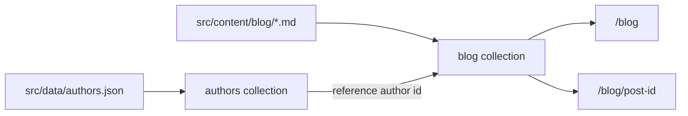

# Build-time blog + authors collections

## Approach

Use **build-time** collections (not live): local Markdown posts + a single authors JSON file, queried with `getCollection` / `getEntry`, prerendered like other static pages on this Cloudflare SSR site.

## 1. Content config

Create `[src/content.config.ts](src/content.config.ts)`:

- `authors` — `file("src/data/authors.json")` + Zod schema (`name`, `bio`, optional `avatar`, `portfolio` / social URL)
- `blog` — `glob({ base: "./src/content/blog", pattern: "**/*.md" })` + schema: `title`, `description`, `pubDate` (`z.coerce.date()`), optional `updatedDate`, `author: reference("authors")`, optional `draft: z.boolean().default(false)`

Export `collections = { blog, authors }`.

## 2. Sample content

- `[src/data/authors.json](src/data/authors.json)` — object-keyed or array-with-`id` entries (e.g. `redaksia`, `reporter`) with Albanian names/bios; include `$schema` pointing at `.astro/collections/authors.schema.json` once generated (or omit until first `astro sync` / build).
- `[src/content/blog/](src/content/blog/)` — 2 short Albanian Markdown posts; frontmatter sets `author` to an authors collection `id`.

## 3. Routes (prerendered)

Site is `output: 'server'`, so opt in like other static pages:

- `[src/pages/blog/index.astro](src/pages/blog/index.astro)` — `export const prerender = true`; `getCollection("blog")` filtered to non-draft, sorted by `pubDate` desc; list title/date/description + link to `/blog/{id}/`.
- `[src/pages/blog/[id].astro](src/pages/blog/[id].astro)` — `prerender = true` + `getStaticPaths()` mapping each non-draft post; `render(post)` → `<Content />`; resolve author via `getEntry(post.data.author)` and show byline.

Reuse existing shell: `BaseLayout` + `SiteHeader` + `page-shell` (same pattern as `[IdeasPage.astro](src/components/IdeasPage.astro)`). Keep styling minimal and consistent with current CSS variables — no new design system.

Optional thin page components under `src/components/` only if the page files get noisy; otherwise keep logic in the page files for this spike.

## 4. Nav discoverability

Wire `/blog` into the header so the spike is reachable:

- Add `blogLabel` to `nav` in `[src/data/site.ts](src/data/site.ts)` (`sq`: "Blog", `en`: "Blog").
- Extend `currentPage` in `[SiteHeader.astro](src/components/SiteHeader.astro)` with `"blog"` and add an `/blog/` link next to the other items.

English `/en/blog` is out of scope (English routes remain disabled).

## 5. Verify

Run via Nix/direnv environment (repo has `shell.nix` + `.envrc`):

- `astro sync` / `pnpm build` (or project Makefile target) so collection types and schemas generate
- Confirm `/blog` and `/blog/<id>/` render with author bylines

No MDX integration for this pass (Markdown only). No live collections.