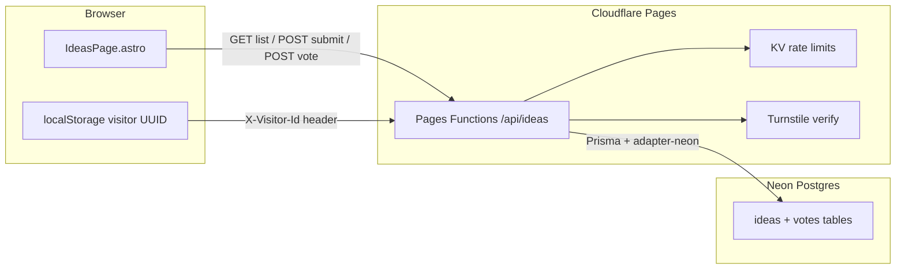

---
todos:
  - id: "infra-neon-cf"
    content: "Create Neon DB, Cloudflare KV namespace, Turnstile widget, and set env vars (DATABASE_URL pooled, secrets)"
    status: pending
  - id: "prisma-schema"
    content: "Add prisma/schema.prisma (Idea + Vote), migrate, optional seed from Sheets export"
    status: pending
  - id: "functions-lib"
    content: "Create functions/lib helpers: prisma, voter hash, KV rate limit, Turnstile verify, validation"
    status: pending
  - id: "api-routes"
    content: "Implement GET/POST /api/ideas and POST /api/ideas/[id]/vote (+ admin PATCH)"
    status: pending
  - id: "ideas-ui"
    content: "Refactor IdeasPage: inline submit form, vote UI, visitor ID, update ideas.ts copy + global.css"
    status: pending
  - id: "remove-google-forms"
    content: "Remove Apps Script function, APPS_SCRIPT env, and all Google Forms links across site + READMEs"
    status: pending
  - id: "build-deploy"
    content: "Update package.json scripts, wrangler.jsonc KV binding, document cf:preview workflow, deploy + smoke test"
    status: pending
isProject: false
---
# Prisma + Neon voting system plan

## Target architecture



**Runtime rule:** DB access stays only in [`functions/`](functions/). Astro remains static SSG; the page fetches from `/api/*` at runtime (same pattern as today in [`src/components/IdeasPage.astro`](src/components/IdeasPage.astro)).

**Curation model:** Public feed shows `VISIBLE` ideas sorted by `score` (upvotes minus downvotes). New submissions are visible immediately; moderators can `HIDDEN` spam via a protected admin endpoint (no admin UI in v1).

---

## 1. Outside the codebase (do first)

### Neon setup
1. Create a [Neon](https://neon.tech) project (pick **EU** region if data residency matters).
2. Create a database (default `neondb` is fine).
3. Copy two connection strings from the Neon dashboard:
   - **Direct** URL — for `prisma migrate` from your laptop/CI
   - **Pooled** URL (host contains `-pooler`) — for Cloudflare Functions (`DATABASE_URL`)
4. Optionally create a **dev branch** in Neon for local experimentation.

### Cloudflare setup
1. In the Pages project dashboard (**Settings → Environment variables**), add production + preview vars:

| Variable | Purpose |
|----------|---------|
| `DATABASE_URL` | Neon **pooled** connection string |
| `VOTER_HASH_SECRET` | Random 32+ byte secret for HMAC voter identity |
| `TURNSTILE_SECRET_KEY` | Cloudflare Turnstile secret |
| `ADMIN_API_KEY` | Bearer token for hide/moderation endpoint |
| `PUBLIC_TURNSTILE_SITE_KEY` | Exposed to frontend (can also be build-time `import.meta.env` if preferred) |

2. Create a **KV namespace** (e.g. `IDEAS_RATE_LIMIT`) for rate-limit counters.
3. Bind it in [`wrangler.jsonc`](wrangler.jsonc):

```jsonc
{
  "kv_namespaces": [
    { "binding": "RATE_LIMIT_KV", "id": "<namespace-id>" }
  ]
}
```

4. Create a **Turnstile widget** in Cloudflare dashboard (managed challenge, invisible or checkbox) for the ideas domain.

### Secrets for local dev
1. Copy [`.dev.vars.example`](.dev.vars.example) → `.dev.vars` with real values (gitignored).
2. Create `.env` at repo root for Prisma CLI only:

```bash
DATABASE_URL="postgresql://...direct-neon-url..."
```

> Prisma migrations use `.env`; Pages Functions use `.dev.vars` (Wrangler convention).

### Data migration (optional)
- Export existing approved ideas from Google Sheets to CSV.
- One-time seed script (`prisma/seed.ts`) to insert historical rows before cutover.

---

## 2. Database schema (Prisma)

Add [`prisma/schema.prisma`](prisma/schema.prisma):

```prisma
enum IdeaStatus {
  VISIBLE
  HIDDEN
}

enum VoteValue {
  UP
  DOWN
}

model Idea {
  id            String     @id @default(uuid())
  createdAt     DateTime   @default(now()) @map("created_at")
  content       String
  name          String?
  status        IdeaStatus @default(VISIBLE)
  submitterHash String     @map("submitter_hash")
  upvoteCount   Int        @default(0) @map("upvote_count")
  downvoteCount Int        @default(0) @map("downvote_count")
  score         Int        @default(0)
  votes         Vote[]

  @@index([status, score(sort: Desc), createdAt(sort: Desc)])
  @@map("ideas")
}

model Vote {
  id        String    @id @default(uuid())
  ideaId    String    @map("idea_id")
  idea      Idea      @relation(fields: [ideaId], references: [id], onDelete: Cascade)
  voterHash String    @map("voter_hash")
  value     VoteValue
  createdAt DateTime  @default(now()) @map("created_at")
  updatedAt DateTime  @updatedAt @map("updated_at")

  @@unique([ideaId, voterHash])
  @@index([voterHash])
  @@map("votes")
}
```

**Design notes:**
- Denormalized `upvoteCount` / `downvoteCount` / `score` on `Idea` keep `GET /api/ideas` fast under load.
- `submitterHash` + `voterHash` store **HMAC hashes only** (no raw IP).
- `@@unique([ideaId, voterHash])` enforces one vote per visitor per idea; changing vote updates the row and adjusts counts in a transaction.

Run locally:

```bash
pnpm prisma migrate dev --name init_ideas_votes
```

---

## 3. Dependencies and build pipeline

Update [`package.json`](package.json):

**Dependencies**
- `@prisma/client`
- `@prisma/adapter-neon`
- `@neondatabase/serverless`

**Dev dependencies**
- `prisma`

**Scripts**
- `"postinstall": "prisma generate"` (or explicit `db:generate`)
- Change `build` to: `prisma generate && astro build`
- Add `db:migrate`, `db:studio`, `db:seed` helpers

**Prisma client on Workers:** instantiate per request with the Neon adapter (documented pattern):

```ts
import { PrismaClient } from "@prisma/client";
import { PrismaNeon } from "@prisma/adapter-neon";

export function createPrisma(databaseUrl: string) {
  const adapter = new PrismaNeon({ connectionString: databaseUrl });
  return new PrismaClient({ adapter });
}
```

**Bundle size:** Prisma adds weight; monitor the Workers bundle. If you hit Cloudflare’s free-tier ~3 MB limit, trim dependencies or upgrade the Workers plan.

---

## 4. Backend: Pages Functions layout

Replace [`functions/api/ideas.js`](functions/api/ideas.js) with TypeScript routes:

```
functions/
  lib/
    prisma.ts        # createPrisma()
    voter.ts         # hashVisitorId(request, env)
    rateLimit.ts     # KV sliding-window limits
    turnstile.ts     # server-side token verification
    validation.ts    # content length, honeypot, JSON parsing
    responses.ts     # jsonResponse helper (reuse existing shape where possible)
  api/
    ideas/
      index.ts       # GET (list), POST (submit)
      [id]/
        vote.ts      # POST (up/down), DELETE optional (remove vote)
        index.ts     # PATCH (admin hide) — ADMIN_API_KEY required
```

### API contract

**`GET /api/ideas`**
- Returns visible ideas sorted by `score DESC, createdAt DESC`.
- Accepts `X-Visitor-Id` header; includes `userVote: "UP" | "DOWN" | null` per idea when present.
- Response shape (backward-compatible where possible):

```json
{
  "ideas": [
    {
      "id": "uuid",
      "timestamp": "2026-07-06T10:00:00.000Z",
      "idea": "text",
      "name": "",
      "upvotes": 12,
      "downvotes": 1,
      "score": 11,
      "userVote": "UP"
    }
  ],
  "stats": { "approved": 42, "pending": 0, "rejected": 0 }
}
```

Keep `stats.approved` as **visible idea count** temporarily so [`IdeasPage.astro`](src/components/IdeasPage.astro) count logic needs minimal change; drop `pending`/`rejected` in a follow-up cleanup.

**`POST /api/ideas`**
- Body: `{ content: string, name?: string, turnstileToken: string, website?: string }`
- `website` is honeypot — reject if non-empty.
- Validates: length (e.g. 20–2000 chars), Turnstile, rate limit.
- Creates `VISIBLE` idea; returns `201` + created idea.

**`POST /api/ideas/:id/vote`**
- Body: `{ value: "UP" | "DOWN" }`
- Rate-limited per `voterHash`.
- Upsert vote; adjust denormalized counts atomically (`prisma.$transaction`).
- If same value posted again, idempotent success.

**`PATCH /api/ideas/:id`** (admin only)
- Header: `Authorization: Bearer <ADMIN_API_KEY>`
- Body: `{ status: "HIDDEN" }` for spam takedown.

### Spam prevention

| Layer | Implementation |
|-------|----------------|
| Bot check | Cloudflare Turnstile on submit |
| Honeypot | Hidden `website` field |
| Rate limits | KV: e.g. 3 submissions / visitor / hour, 30 votes / visitor / hour |
| Identity | `voterHash = HMAC-SHA256(VOTER_HASH_SECRET, visitorId + IP)` |
| Validation | Min/max length, trim, reject empty/duplicate rapid submits |
| Moderation | Admin PATCH to `HIDDEN` |

**Voter ID flow:** On first visit, client generates a UUID → `localStorage` → sends `X-Visitor-Id` on all API calls.

### Caching

Keep short CDN cache on `GET` (existing pattern in ideas.js: `s-maxage=5, stale-while-revalidate=10`). Use `no-store` on `POST`/`PATCH`.

---

## 5. Frontend changes

### [`src/components/IdeasPage.astro`](src/components/IdeasPage.astro)
- Remove external `formUrl` buttons.
- Add **inline submission form** (textarea + optional name + Turnstile widget + honeypot + submit).
- Extend idea cards with **upvote / downvote** buttons and score display.
- Client script changes:
  - Manage `visitorId` in `localStorage`.
  - Send `X-Visitor-Id` on fetch.
  - `POST` new ideas; optimistic UI optional but not required.
  - Vote handler calls `POST /api/ideas/:id/vote`.
  - Keep 10s polling on `GET` or switch to poll-after-action only (polling still fine for v1).

### [`src/data/ideas.ts`](src/data/ideas.ts)
- Remove `formUrl`; add copy for submit form, vote labels, Turnstile errors, rate-limit messages.
- Update meta description (no “Google Forms”).

### [`src/styles/global.css`](src/styles/global.css)
- Add mobile-first styles for:
  - `.ideas-form` (large tap targets, full-width textarea, 16px+ font to avoid iOS zoom)
  - `.published-idea__votes` (thumb up/down buttons, active state, score)
- Reuse existing `.button`, `.ideas-page` patterns.

### Remove Google Forms links site-wide
Update internal links to `/idete-tuaja/` (or `#submit` anchor):

| File | Change |
|------|--------|
| [`src/data/site.ts`](src/data/site.ts) | `participateLink`, `council.primaryLink`, `closing` CTA → `/idete-tuaja/` |
| [`src/components/SiteHeader.astro`](src/components/SiteHeader.astro) | CTA: internal link, remove `target="_blank"` |
| [`src/components/ContactPage.astro`](src/components/ContactPage.astro) | Point “propozime” panel to `/idete-tuaja/` |
| [`src/components/DocumentLibraryPage.astro`](src/components/DocumentLibraryPage.astro) | Same CTA update |
| [`README.md`](README.md) / [`README.en.md`](README.en.md) | Document new env vars; remove Apps Script section |

### Delete legacy integration
- Remove [`functions/api/ideas.js`](functions/api/ideas.js) Apps Script fetch logic entirely.
- Remove `APPS_SCRIPT_API_URL` from [`.dev.vars.example`](.dev.vars.example).

---

## 6. TypeScript / env typing

- Add [`functions/env.d.ts`](functions/env.d.ts) (or extend wrangler types) for `Env` bindings: `DATABASE_URL`, `VOTER_HASH_SECRET`, `TURNSTILE_SECRET_KEY`, `ADMIN_API_KEY`, `RATE_LIMIT_KV`.
- Optionally add shared types in [`src/types/ideas.ts`](src/types/ideas.ts) for API payloads used by the page script.

---

## 7. Local development workflow

| Task | Command |
|------|---------|
| Static site only | `pnpm dev` (no API) |
| Full stack (site + functions + DB) | `pnpm cf:preview` after `pnpm build` |
| DB migrations | `pnpm prisma migrate dev` (uses `.env`) |
| Inspect data | `pnpm prisma studio` |
| Test API | `curl` against `wrangler pages dev` URL |

Document in README: **API features require `cf:preview`**, not plain `astro dev`.

---

## 8. Deployment checklist

1. Run `prisma migrate deploy` against production Neon (CI step or manual before first deploy).
2. Set all Cloudflare Pages env vars (production + preview).
3. Bind KV namespace in `wrangler.jsonc`.
4. `git push` to `main` (existing Cloudflare Pages auto-deploy) or `pnpm cf:deploy`.
5. Smoke test on production:
   - Submit idea from phone browser
   - Vote up/down
   - Confirm rate limit returns `429`
   - Confirm Turnstile blocks bots
6. Decommission Google Apps Script deployment and archive the Form (outside repo).

---

## 9. Suggested implementation order

1. **Infra** — Neon project, env vars, KV, Turnstile keys
2. **Schema** — Prisma init, migrate, seed optional historical data
3. **Shared libs** — `prisma.ts`, `voter.ts`, `rateLimit.ts`, `turnstile.ts`
4. **API** — `GET` list (read path first, verify end-to-end)
5. **API** — `POST` submit + `POST` vote
6. **API** — admin `PATCH` hide
7. **UI** — submission form + vote controls + copy/CSS
8. **Cleanup** — remove Google Forms references, update README
9. **Load sanity** — verify indexes, short GET cache, Neon pooled URL

---

## 10. Acceptance criteria mapping

| Criterion | How it’s met |
|-----------|--------------|
| No Google Forms | Remove links + Apps Script; in-page submit |
| Direct submission | `POST /api/ideas` |
| Voting works | `POST /api/ideas/:id/vote` + UI buttons |
| Spam prevention | Turnstile + KV rate limits + honeypot + hashing |
| Mobile accessible | Inline form, large inputs, existing responsive CSS extended |

---

## Risks and mitigations

- **Prisma + Neon hangs on Workers:** use Neon HTTP driver via `@prisma/adapter-neon`; if issues appear in dev, apply documented `maxUses: 1` pool workaround.
- **Vote manipulation:** hashing reduces casual abuse; rate limits cap volume; Turnstile on submit; consider Turnstile on vote later if needed.
- **High traffic:** denormalized scores + GET caching + Neon pooler; monitor Neon compute.
- **GDPR:** store hashes not raw IPs; keep privacy note on page; no email collection required.
