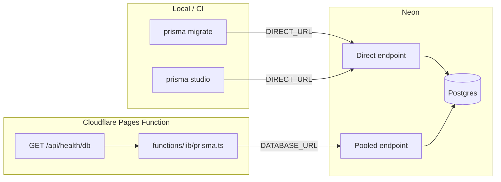

---
todos:
  - id: neon-project
    content: "Create Neon project (EU), note pooled + direct connection strings"
    status: completed
  - id: deps-scripts
    content: "Add prisma, @prisma/client, @prisma/adapter-neon; wire generate into build + db:* scripts"
    status: completed
  - id: schema-config
    content: "Add prisma/schema.prisma (Idea + Vote) and prisma.config.ts with DIRECT_URL for migrations"
    status: completed
  - id: env-wiring
    content: "Document .env (DIRECT_URL + DATABASE_URL + APPS_SCRIPT); Cloudflare Pages env for prod; .env.example + .gitignore"
    status: completed
  - id: migrate
    content: "Run prisma migrate dev --name init_ideas_votes against Neon"
    status: pending
  - id: client-helper
    content: "Add functions/lib/prisma.ts createPrisma(env) using PrismaNeon adapter"
    status: completed
  - id: smoke-route
    content: "Temporary GET /api/health/db (or extend ideas) that runs SELECT 1 / count ideas; verify via cf:preview"
    status: pending
  - id: docs
    content: "Document Neon + Prisma local/prod workflow in README.md and README.en.md"
    status: completed
isProject: false
---

# Plan: Prisma + Neon setup

**Scope:** Database project, Prisma schema/migrations, Cloudflare-compatible client, and a connectivity smoke test.

**Out of scope (later plans):** submit/vote APIs, Turnstile, KV rate limits, IdeasPage UI, Google Forms removal.

**Depends on:** nothing in-repo today (no Prisma, no DB).

**Unlocks:** voting/submissions backend work.

---

## Goal

Neon Postgres is reachable from:

1. **Laptop/CI** — Prisma Migrate / Studio (direct connection)
2. **Cloudflare Pages Functions** — Prisma Client via `@prisma/adapter-neon` (pooled connection)

Schema for ideas + votes exists and is migrated. No product API yet beyond a temporary health check.

---

## Target layout

```text
.
├─ prisma/
│  ├─ schema.prisma
│  └─ migrations/
├─ prisma.config.ts          # CLI datasource (Prisma 7+)
├─ functions/
│  └─ lib/
│     └─ prisma.ts           # createPrisma(databaseUrl)
├─ .env                      # DIRECT_URL + DATABASE_URL (+ APPS_SCRIPT) — gitignored
└─ .env.example
```

**Runtime rule:** Prisma Client is only constructed inside `functions/`. Astro stays static SSG.



---

## 1. Neon project (manual, first)

1. Create a [Neon](https://neon.tech) project — prefer **EU** region.
2. Use default DB name (`neondb`) unless you need otherwise.
3. From the dashboard, copy:
   - **Pooled** connection string (host contains `-pooler`) → runtime `DATABASE_URL`
   - **Direct** connection string → CLI `DIRECT_URL`
4. Optional: create a Neon **dev branch** for local experiments; keep production branch for deploy.

Both URLs need `?sslmode=require` (Neon usually includes this).

---

## 2. Packages and scripts

Install:

| Package | Role |
|---------|------|
| `prisma` (dev) | CLI, migrate, generate |
| `@prisma/client` | Generated client |
| `@prisma/adapter-neon` | Serverless/WebSocket driver for Workers/Pages |

Do **not** add `@neondatabase/serverless` separately unless a pinned Prisma version requires it — the adapter bundles what it needs on current Prisma.

Update [`package.json`](package.json) scripts:

```json
{
  "postinstall": "prisma generate",
  "build": "prisma generate && astro build",
  "db:generate": "prisma generate",
  "db:migrate": "prisma migrate dev",
  "db:migrate:deploy": "prisma migrate deploy",
  "db:studio": "prisma studio"
}
```

`cf:preview` / `cf:deploy` already call `build`, so client generation stays in the Pages pipeline.

---

## 3. Schema

Add [`prisma/schema.prisma`](prisma/schema.prisma) — models needed by the later voting plan, migrated now so the DB is ready:

```prisma
generator client {
  provider = "prisma-client-js"
}

datasource db {
  provider = "postgresql"
  // Prisma 7+: connection URLs live in prisma.config.ts, not here
}

enum IdeaStatus {
  VISIBLE
  HIDDEN
}

enum VoteValue {
  UP
  DOWN
}

model Idea {
  id            String     @id @default(uuid())
  createdAt     DateTime   @default(now()) @map("created_at")
  content       String
  name          String?
  status        IdeaStatus @default(VISIBLE)
  submitterHash String     @map("submitter_hash")
  upvoteCount   Int        @default(0) @map("upvote_count")
  downvoteCount Int        @default(0) @map("downvote_count")
  score         Int        @default(0)
  votes         Vote[]

  @@index([status, score(sort: Desc), createdAt(sort: Desc)])
  @@map("ideas")
}

model Vote {
  id        String    @id @default(uuid())
  ideaId    String    @map("idea_id")
  idea      Idea      @relation(fields: [ideaId], references: [id], onDelete: Cascade)
  voterHash String    @map("voter_hash")
  value     VoteValue
  createdAt DateTime  @default(now()) @map("created_at")
  updatedAt DateTime  @updatedAt @map("updated_at")

  @@unique([ideaId, voterHash])
  @@index([voterHash])
  @@map("votes")
}
```

**Notes:**
- No `IdeaSource` / Google Forms field — single intake path later.
- Denormalized vote counts are schema-only in this phase; APIs come next.
- If the installed Prisma major still expects `url` / `directUrl` in `schema.prisma`, follow that version’s docs instead of `prisma.config.ts` — pin whatever `pnpm add prisma` resolves and match its config style.

Add root [`prisma.config.ts`](prisma.config.ts) (Prisma 7+ pattern) pointing migrations at `DIRECT_URL`.

---

## 4. Environment wiring

| File / place | Variable | Value |
|--------------|----------|--------|
| `.env` (gitignored) | `DIRECT_URL` | Neon **direct** — Prisma CLI |
| `.env` (gitignored) | `DATABASE_URL` | Neon **pooled** — Wrangler + optional local tooling |
| `.env` (gitignored) | `APPS_SCRIPT_API_URL` | Existing Apps Script feed (until Forms-removal plan) |
| Cloudflare Pages (prod + preview) | `DATABASE_URL` | Neon **pooled** |

Update [`.env.example`](.env.example) with placeholders for all three.

Keep `APPS_SCRIPT_API_URL` until the Forms-removal plan removes it — this plan does not delete the Apps Script proxy.

Confirm `.env` is gitignored and `.env.example` is committed. Do **not** use `.dev.vars` — Wrangler loads `.env` when `.dev.vars` is absent; using both is redundant and confusing.

---

## 5. Migrate

```bash
pnpm db:migrate --name init_ideas_votes
# or: pnpm prisma migrate dev --name init_ideas_votes
```

Verify with `pnpm db:studio` — empty `ideas` / `votes` tables.

For production (before or with first deploy that needs the DB):

```bash
pnpm db:migrate:deploy
```

(Uses `DIRECT_URL` from the environment where the command runs.)

---

## 6. Functions client helper

Add [`functions/lib/prisma.ts`](functions/lib/prisma.ts):

```ts
import { PrismaClient } from "@prisma/client";
import { PrismaNeon } from "@prisma/adapter-neon";

export function createPrisma(databaseUrl: string) {
  const adapter = new PrismaNeon({ connectionString: databaseUrl });
  return new PrismaClient({ adapter });
}
```

Add [`functions/env.d.ts`](functions/env.d.ts) (or extend existing types) so `Env` includes `DATABASE_URL: string`.

**Hanging-query workaround:** if `wrangler pages dev` hangs after DB writes succeed, recreate the adapter/pool with `maxUses: 1` (known Neon serverless + Workers issue). Prefer the simple constructor first; only add the workaround if smoke fails.

Always `$disconnect()` (or `ctx.waitUntil(prisma.$disconnect())`) when the request finishes if the runtime keeps the isolate warm.

---

## 7. Connectivity smoke (temporary)

Add a minimal route, e.g. [`functions/api/health/db.ts`](functions/api/health/db.ts):

- `GET` → `createPrisma(env.DATABASE_URL)` → `prisma.idea.count()` (or raw `SELECT 1`)
- Return `{ ok: true, ideaCount: n }` JSON
- `500` + short message if `DATABASE_URL` missing or query fails

Verify:

```bash
pnpm cf:preview
# curl http://127.0.0.1:8788/api/health/db
```

Do **not** change [`functions/api/ideas.js`](functions/api/ideas.js) in this phase — keep the Apps Script feed working until the API rewrite plan.

Remove or lock down `/api/health/db` before public launch (or protect with `ADMIN_API_KEY` in a later hardening pass).

---

## 8. Docs

Update [`README.md`](README.md) / [`README.en.md`](README.en.md) under a short “Database” section:

- Neon pooled vs direct
- Single `.env` for local secrets (CLI + Wrangler); Pages dashboard for deploy
- `pnpm db:migrate` / `db:studio` / `cf:preview` for Functions + DB
- Note that `astro dev` alone does **not** run Pages Functions or hit Neon

---

## Implementation order

1. Create Neon project; copy both URLs  
2. Install packages; update scripts  
3. Add schema + `prisma.config.ts`  
4. Wire `.env` / `.env.example`  
5. `migrate dev` → confirm tables in Studio  
6. `functions/lib/prisma.ts` + env types  
7. Smoke `GET /api/health/db` via `cf:preview`  
8. README notes  
9. Set `DATABASE_URL` on Cloudflare Pages (preview + production) when ready to deploy  

---

## Acceptance criteria

| Criterion | Check |
|-----------|--------|
| Neon project exists | Dashboard shows DB + both connection strings |
| Schema migrated | `ideas` and `votes` tables present |
| CLI works | `pnpm db:migrate` / `pnpm db:studio` against `DIRECT_URL` |
| Functions connect | `GET /api/health/db` returns `ok: true` under `cf:preview` |
| Build still works | `pnpm build` runs `prisma generate` then Astro |
| No product scope creep | No submit/vote UI, no Forms removal, ideas feed still Apps Script |

---

## Risks

| Risk | Mitigation |
|------|------------|
| Prisma major (6 vs 7) config differences | Install first; follow that version’s Neon + Cloudflare docs for `schema` vs `prisma.config.ts` |
| Workers request hangs on Neon | Try `maxUses: 1` pool option; disconnect client per request |
| Bundle size on Pages free tier | Generate client only; avoid pulling unused Prisma engines; monitor Wrangler deploy size |
| Accidental commit of secrets | Keep `.env` gitignored; only commit `.env.example` |

---

## Explicit non-goals

- Vote / submit endpoints  
- Turnstile, KV, admin PATCH  
- Seed from Google Sheets (optional follow-up once health check passes)  
- Removing Google Forms or `APPS_SCRIPT_API_URL`
